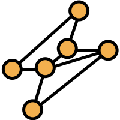

<!--
*** NB: This template was taken from: https://github.com/othneildrew/Best-README-Template/blob/master/README.md?plain=1 
*** For shields, see: https://shields.io/
-->
<a name="readme-top"></a>

<!-- PROJECT SHIELDS -->
<!--
*** I'm using markdown "reference style" links for readability.
*** Reference links are enclosed in brackets [ ] instead of parentheses ( ).
*** See the bottom of this document for the declaration of the reference variables
*** for contributors-url, forks-url, etc. This is an optional, concise syntax you may use.
*** https://www.markdownguide.org/basic-syntax/#reference-style-links
-->


[![Issues][issues-shield]][issues-url]
[![MIT License][license-shield]][license-url]
[![LinkedIn][linkedin-shield]][linkedin-url]

<!-- PROJECT LOGO -->
<br />
<div align="center">
  <a href="https://github.com/7Cedars/snapshot-dashboard-next"> 
    
  </a>

<h3 align="center">Snapnet: Visualising DAO voter networks</h3>

  <p align="center">
    Mapping voting behaviour of DAO members on Snapshot.org
    <br />
    <a href="https://github.com/7Cedars/snapshot-dashboard-next"><strong>Explore the docs »</strong></a>
    <br />
    <br />
    <!--NB: TO DO --> 
    <a href="https://snapshot-dashboard-next.vercel.app/">View Demo</a>
    ·
    <a href="https://github.com/7Cedars/snapshot-dashboard-next/issues">Report Bug</a>
    ·
    <a href="https://github.com/7Cedars/snapshot-dashboard-next/issues">Request Feature</a>
  </p>
</div>

<!-- TABLE OF CONTENTS -->
<details>
  <summary>Table of Contents</summary>
  <ol>
    <li>
      <a href="#about-the-project">About The Project</a>
      <ul>
        <li><a href="#built-with">Built With</a></li>
      </ul>
    </li>
    <li>
      <a href="#getting-started">Getting Started</a>
      <ul>
        <li><a href="#prerequisites">Prerequisites</a></li>
        <li><a href="#installation">Installation</a></li>
      </ul>
    </li>
    <li><a href="#usage">Usage</a></li>
    <li><a href="#roadmap">Roadmap</a></li>
    <li><a href="#contributing">Contributing</a></li>
    <li><a href="#license">License</a></li>
    <li><a href="#contact">Contact</a></li>
    <li><a href="#acknowledgments">Acknowledgments</a></li>
  </ol>
</details>


<!-- ABOUT THE PROJECT -->
## About The Project
Snapnet maps voting behaviour of DAO members on Snapshot.

<p align="right">(<a href="#readme-top">back to top</a>)</p>

### Built With
<!-- See for a list of badges: https://github.com/Envoy-VC/awesome-badges -->
* [![Next][Next.js]][Next-url]  
* [![React][React.js]][React-url] 
* [![Redux][Redux]][Redux-url]  
* [![Tailwind][Tailwind-css]][Tailwind-url]

<p align="right">(<a href="#readme-top">back to top</a>)</p>

<!-- GETTING STARTED -->
## Getting Started

To get a local copy up and running do the following.

### Prerequisites

  Npm and yarn
  ```sh
  npm install --global npm@latest yarn  
  ```

### Installation
<!-- NB: I have to check if I missed anyting £todo -->

1. Clone the repo
   ```sh
   git clone https://github.com/7Cedars/snapshot-dashboard-next.git
   ```
2. Install packages
   ```sh
   yarn add
   ```
3. And simply run 
   ```sh
   yarn dev
   ```

<p align="right">(<a href="#readme-top">back to top</a>)</p>


<!-- USAGE EXAMPLES -->
## Usage
The app is deployed at [snapshot-dashboard-next.vercel.app](https://snapshot-dashboard-next.vercel.app/). 

The user selects what DAO's are mapped, across which time period. 

Snapnet then creates a network graph. In this graph DAO's are nodes and shared voters are links. In other words, whenever a single blockchain address voted for a proposal in two different DAO's, a link between the two exists. Wider links between DAOs mean more shared voters, larger size nodes mean more votes overall.

It is also possible to select a single DAO and get more detail about the DAO itself and voting behaviour of its community.

_For more examples, please refer to the [FAQ](snapshot-dashboard-next.vercel.app) in the App itself_

<p align="right">(<a href="#readme-top">back to top</a>)</p>

<!-- ROADMAP -->
## Roadmap

- [ ] Implement Cypress testing throughout app. At the moment the app is untested. 
- [ ] Code clean up and optimisation. 
- [ ] ... 

See the [open issues](https://github.com/7Cedars/snapshot-dashboard-next/issues) for a full list of proposed features (and known issues).

<p align="right">(<a href="#readme-top">back to top</a>)</p>

<!-- CONTRIBUTING -->
## Contributing

Contributions make the open source community such an amazing place to learn, inspire, and create. Any contributions you make are greatly appreciated.

If you have a suggestion that would make this better, please fork the repo and create a pull request. You can also simply open an issue with the tag "enhancement". Thank you! 

1. Fork the Project
2. Create your Feature Branch (`git checkout -b feature/AmazingFeature`)
3. Commit your Changes (`git commit -m 'Add some AmazingFeature'`)
4. Push to the Branch (`git push origin feature/AmazingFeature`)
5. Open a Pull Request

<p align="right">(<a href="#readme-top">back to top</a>)</p>


<!-- LICENSE -->
## License

Distributed under the MIT License. See `LICENSE.txt` for more information.

<p align="right">(<a href="#readme-top">back to top</a>)</p>

<!-- CONTACT -->
## Contact

Seven Cedars - [@7__Cedars](https://twitter.com/7__Cedars) - cedars7@proton.me

GitHub profile [https://github.com/7Cedars](https://github.com/7Cedars)

<p align="right">(<a href="#readme-top">back to top</a>)</p>

<!-- ACKNOWLEDGMENTS -->
## Acknowledgments
* A big thank you to [Snapshot.org](Snapshot.org) for making their API publicly available. 
* I built this app after completing Matti Luukkainen's amazing [Fullstack open](https://fullstackopen.com/en/) course at the University of Helsinki. It comes highly recommended for anyone interested to learn React, Javascrip, Redux, Typescript - and a whole lot more of what is needed to become a fullstack dev. 
* I took the template for the readme file from [Drew Othneil](https://github.com/othneildrew/Best-README-Template/blob/master/README.md?plain=1). 
* The network graph was adapted from the observablehq [here](https://observablehq.com/@d3/force-directed-graph). 
* An honourable mention goes to [this stackExchange conversation](https://stackoverflow.com/questions/14610954/can-an-svg-pattern-be-implemented-in-d3) that solved dynamic backgrounds of nodes for me. 
* The theme switcher was taken from [nextjsdev](https://nextjsdev.com/dark-mode-in-next-js-13-app-using-tailwind-css/#step-3-creating-the-theme-provider-and-theme-switcher). 
* Other acknowledgments are mentioned in the code, marked with the `£ack`  label. 
<p align="right">(<a href="#readme-top">back to top</a>)</p>

<!-- MARKDOWN LINKS & IMAGES -->
[issues-shield]: https://img.shields.io/github/issues/7Cedars/loyalty-program-next.svg?style=for-the-badge
[issues-url]: https://github.com/7Cedars/snapshot-dashboard-next/issues/
[license-shield]: https://img.shields.io/github/license/7Cedars/loyalty-program-next.svg?style=for-the-badge
[license-url]: https://github.com/7Cedars/snapshot-dashboard-next/LICENSE.txt
[linkedin-shield]: https://img.shields.io/badge/-LinkedIn-black.svg?style=for-the-badge&logo=linkedin&colorB=555
[linkedin-url]: https://linkedin.com/in/linkedin_username
[product-screenshot]: images/screenshot.png
<!-- See list of icons here: https://hendrasob.github.io/badges/ -->
[Next.js]: https://img.shields.io/badge/next.js-000000?style=for-the-badge&logo=nextdotjs&logoColor=white
[Next-url]: https://nextjs.org/
[React.js]: https://img.shields.io/badge/React-20232A?style=for-the-badge&logo=react&logoColor=61DAFB
[React-url]: https://reactjs.org/
[Tailwind-css]: https://img.shields.io/badge/Tailwind_CSS-38B2AC?style=for-the-badge&logo=tailwind-css&logoColor=white
[Tailwind-url]: https://tailwindcss.com/
[Vue.js]: https://img.shields.io/badge/Vue.js-35495E?style=for-the-badge&logo=vuedotjs&logoColor=4FC08D
[Redux]: https://img.shields.io/badge/Redux-593D88?style=for-the-badge&logo=redux&logoColor=white
[Redux-url]: https://redux.js.org/
[Vue-url]: https://vuejs.org/
[Angular.io]: https://img.shields.io/badge/Angular-DD0031?style=for-the-badge&logo=angular&logoColor=white
[Angular-url]: https://angular.io/
[Svelte.dev]: https://img.shields.io/badge/Svelte-4A4A55?style=for-the-badge&logo=svelte&logoColor=FF3E00
[Svelte-url]: https://svelte.dev/
[Laravel.com]: https://img.shields.io/badge/Laravel-FF2D20?style=for-the-badge&logo=laravel&logoColor=white
[Laravel-url]: https://laravel.com
[Bootstrap.com]: https://img.shields.io/badge/Bootstrap-563D7C?style=for-the-badge&logo=bootstrap&logoColor=white
[Bootstrap-url]: https://getbootstrap.com
[JQuery.com]: https://img.shields.io/badge/jQuery-0769AD?style=for-the-badge&logo=jquery&logoColor=white
[JQuery-url]: https://jquery.com 
